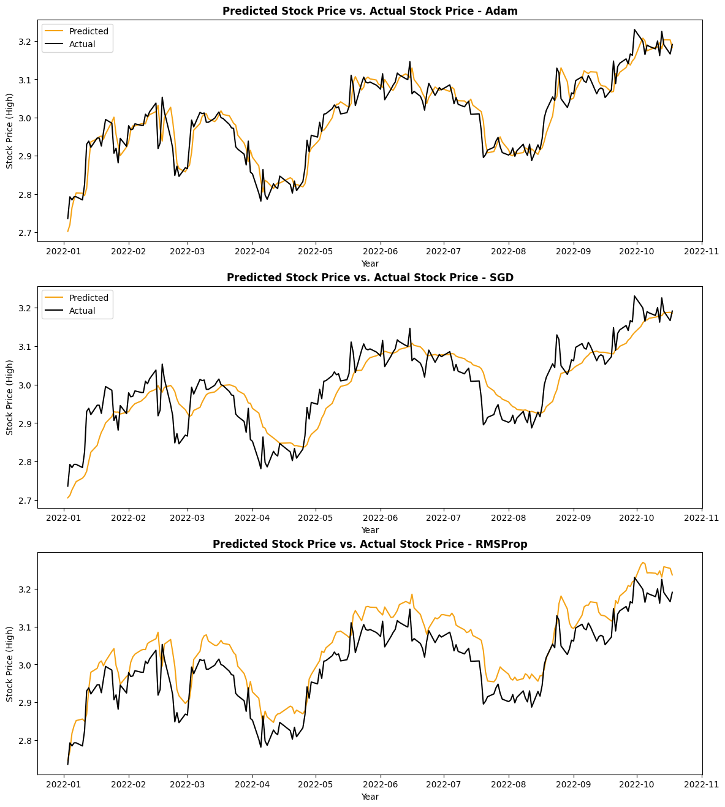

# LSTM Stock Price Prediction for SIA

## ⭐ Introduction
This project builds a **Long Short-Term Memory (LSTM)** neural network to predict SIA stock prices.

- The model predicts the **next day's high price** based on the past **52 days of stock performance**.
- 3 models were trained using different **optimizers** (`Adam`, `SGD`, and `RMSProp`) to determine the best-performing model.
- This project was first completed as part of a machine learning module (ENG335) in my minor coursework. Changes were made for reproducibility and clearer analysis.

### 🗂️ Dataset Used
- **Ticker Symbol**: `SIA1.SG`
- **Training** Dataset: **8 years** of **historical stock data (2014-2021)** from Yahoo Finance (`yfinance` API).
- **Testing** Dataset: **2022 stock price data**.

### 📘 Libraries Used
- `keras`, `tensorflow`, `pandas`, `numpy`, `matplotlib`, `seaborn`
- Random `seed` set to **42** for reproducibility.

---

## ⭐ Repository Structure
- 🍞 `lstm-stock-price-prediction.ipynb` – contains data analysis, model training and evaluation
- 🍞 `imgs/` – graphs and visualisations on EDA and comparison of model performance
- 🍞 `requirements.txt ` - lists required Python packages

---

## ⭐ Model Selection & Results
### 📌 Objective
This project evaluates 3 different optimizers (`Adam`, `SGD`, `RMSProp`) to identify the most effective one for **predicting SIA stock prices**.

### 🌟 Best Model: LSTM with `Adam` Optimizer (Model 1)
- **Adam** was the best optimizer, achieving the **lowest MSE, MAE, and MAPE** and **highest R² Score at 0.88525**.
- **SGD** had higher error values in general, and there is an obvious time lag in its price predictions. Predicted stock prices reacted **slower than actual market trends**.
- **RMSProp** had similar error values to **Adam**, but tended to overestimate stock prices, making it unreliable for precise stock price prediction.

### 📈 Visualisation of Predicted Stock Prices vs Actual Stock Prices  


---

## ⭐ How to Run  
### 1. Clone this repository:
```bash
git clone https://github.com/dorcasshee/lstm-stock-price-prediction.git
cd lstm-stock-price-prediction
```

### 2. [Optional] Create a virtual environment
You may want to use a virtual environment for dependency management. You can run the following commands to create and activate a new virtual environment:
```powershell
python -m venv [venvName] # only run once
[venvName]\Scripts\activate # windows
```
Replace `[venvName]` with your desired virtual environment name. E.g., `lstm-env`.

### 3. [Recommended] Upgrade `pip`
```powershell
python -m pip install --upgrade pip
```

### 4. Install dependencies:  
```powershell
pip install -r requirements.txt
pip install notebook ipykernel
```

### 5. Install `ipykernel` as `[venvName]`
```powershell
python -m ipykernel install --user --name=[venvName] --display-name "Python ([venvName])”
```

### 6. Run `lstm-stock-price-prediction.ipynb` using Jupyter Notebook
```powershell
jupyter notebook
```
Alternatively, you can run the IPYNB file in **Visual Studio Code** if you have the Jupyter extension. Ensure that the kernel is set to `Python ([venvName])`.

### 7. [Optional] Deactivate the virtual environment
Deactivate the virtual environment if you do not need to use it anymore.
```powershell
deactivate
```

---

## ⭐ Future Improvements
- **Evaluate models across different industries and time periods**
  - Test models on stocks from various sectors to assess their adaptability to different market conditions.
  - E.g., Tech, FMCG, energy.
- **Deploy model as web application**
  - Integrate best-performing model into a Flask API and containerise it with Docker
  - A web-based interface can be developed to allow business users to input ticker symbols and forecast prices for a speciied period.
  - This is similar to my other project on [predicting customer churn](https://github.com/dorcasshee/customer-churn-prediction).

---

## ⭐ Let's Connect!
Thanks for checking out this project!  
If you have any questions, feedback, or collaboration opportunities, feel free to reach out!  

🔗 **LinkedIn:** https://www.linkedin.com/in/dorcasshee/  
📧 **Email:** dorcasshee@outlook.com